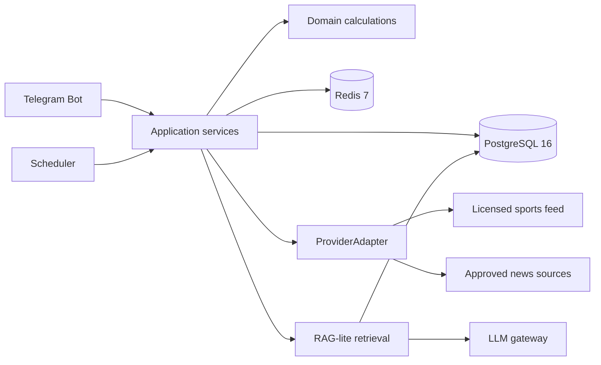

# Целевая архитектура

> Статус: принятое направление модульного монолита; интерфейсы являются проектным контрактом до реализации. Владелец: Иван. Последняя проверка: 4 сентября 2026 года.

## Принцип

Один Python-сервис развёртывается Docker Compose на российском VPS. Внутри сохраняются строгие границы Telegram, приложения, домена, поставщиков и инфраструктуры. Микросервисы не нужны до появления измеренной проблемы масштабирования.



## Стек

- Python 3.14 stable;
- aiogram 3;
- HTTPX `AsyncClient`;
- Pydantic 2;
- SQLAlchemy 2 + asyncpg + Alembic;
- PostgreSQL 16;
- Redis 7;
- APScheduler на beta;
- pytest, pytest-asyncio, respx;
- Ruff и Pyright;
- Matplotlib и mplsoccer для серверных PNG;
- Docker Compose, JSON-логи и Sentry.

Python 3.15 не принимается до стабильного релиза и проверки библиотек. Версия Python фиксируется в CI и контейнере, а не определяется установленным Python разработчика.

## Границы модулей

```text
presentation/telegram  -> кнопки, команды, Telegram DTO
application            -> сценарии, права доступа, orchestration
domain                 -> сущности, метрики, расчёты, правила уверенности
providers              -> спортивные и новостные адаптеры
infrastructure         -> Postgres, Redis, LLM, scheduler, observability
```

Telegram handler не выполняет HTTP-запросы и SQL напрямую. Домен не импортирует aiogram, HTTPX, SQLAlchemy или SDK модели.

## Проектные контракты

### ProviderAdapter

Возвращает нормализованные матчи, команды, игроков, события, статистику, судей, составы и травмы вместе с происхождением. Ошибка адаптера типизирована как временная, постоянная, лимит или нарушение контракта данных.

### CoverageProfile

Определяет доступность показателя по `provider`, `competition`, `season` и `metric`; содержит глубину `basic/deep`, полноту, свежесть и дату последнего QA.

### Evidence

Содержит `source_type`, `provider`, `source_url`, `observed_at`, `sample_size`, `season/competition`, `quality_tier` и ограничения использования.

### MatchBrief

Версионируемый снимок: матч, блоки фактов, источники, предупреждения о покрытии, рассчитанная уверенность и список изменений относительно предыдущей версии.

### Entitlements

Вычисляет доступ из плана, Trial, периода подписки и дневных лимитов; Telegram UI только отображает результат.

### SubscriptionLedger

Добавляемая история invoice, успешных оплат, периодов доступа, продлений и возвратов. Текущее право Pro является проекцией ledger, а не вручную переключаемым флагом.

### UnitEconomicsSnapshot

Финансовый снимок с датой, курсом, Star price/reward, постоянными и переменными затратами, налогом, резервами, CAC, retention и LTV.

## PostgreSQL — источник истины

Группы данных:

- competitions, seasons, teams, players и provider mappings;
- fixtures, events, team/player match statistics;
- referees, appointments, lineups и availability reports;
- normalized facts, evidence и coverage profiles;
- match brief versions и material changes;
- users, watches, entitlements, subscription ledger и payment events;
- product events и consent records.

Один и тот же показатель разных поставщиков не объединяется молча. Хранится provider-specific наблюдение, а правило выбора канонического значения является явным и тестируемым.

## Redis — только временное состояние

| Ключ | TTL |
|---|---:|
| карточка матча | 5–15 минут |
| готовый разбор | 15 минут |
| distributed lock | 2 минуты |
| dedup уведомления | 48 часов |
| дневные AI-счётчики | до конца UTC-дня |

Удаление Redis не должно уничтожать матчи, оплаты, историю подписки или источники. Redis не является базой знаний.

## RAG-lite и LLM

Первый retrieval использует структурные фильтры и PostgreSQL full-text search. pgvector добавляется только если benchmark из 30 реальных вопросов докажет прирост качества. LLM получает выбранные факты и evidence, формирует объяснение, но не рассчитывает статистику.

Gateway поддерживает основной российский AI-прокси и GigaChat fallback. Внешней модели не передаются Telegram ID, имя, платёжные данные или полный профиль. Текст вопроса хранится 30 дней только с согласием.

## Планировщик и идемпотентность

Задачи обновления используют стабильные ключи `provider + external_match_id + snapshot_type`. Повторный запуск не создаёт дубликаты событий и уведомлений. Снимки: 24 часа, 6 часов, официальный состав и ручной refresh.

## Развёртывание

На одном VPS запускаются bot/application, PostgreSQL и Redis; бэкап базы уходит в S3. Секреты передаются окружением. Healthcheck проверяет процесс, БД и Redis отдельно; отказ внешнего поставщика не делает healthcheck приложения красным, но отражается в метриках свежести.
